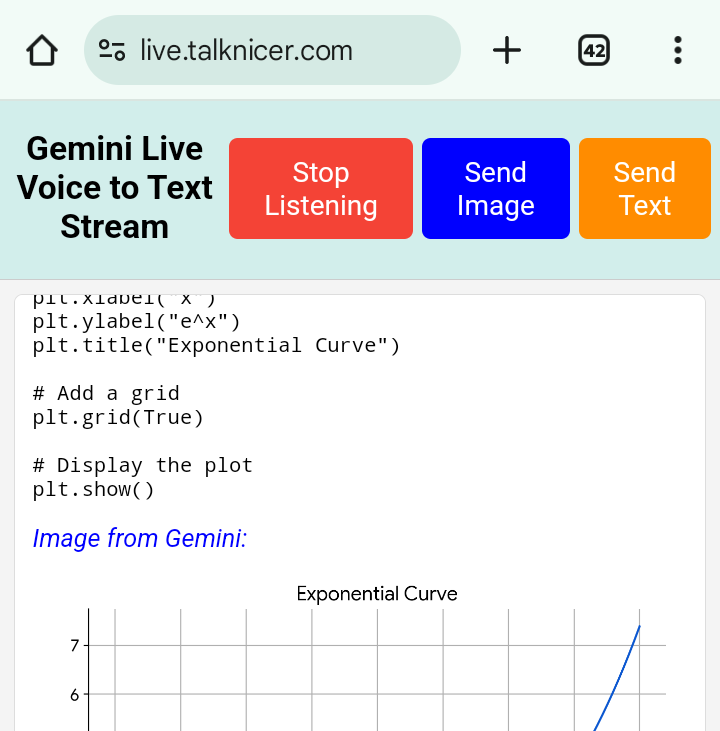

# Gemini Live Voice to Text Realtime Stream

[](https://live.talknicer.com)
[](https://github.com/googleapis/js-genai)
[](https://www.npmjs.com/package/marked-katex-extension)
[](https://opensource.org/licenses/MIT)
[](https://paypal.me/jsalsman)

This **Gemini Live Voice to Text Realtime Stream** running at [live.talknicer.com](https://live.talknicer.com) is a web application that provides a free, live, real-time voice-to-text large language model interaction experience using Google's new `js-genai` API. This project harnesses the power of Gemini 3.8 Live in real-time to provide a seamless voice-driven experience for users, allowing them to chat with the model while reading the output instead of having to wait much longer for synthesized speech, which can't be skimmed. Google Search is available, along with image upload (including from the camera on mobile), text input (including pasting), and both markdown and LaTeX output display. It runs entirely in the browser after the API key cookie is set, and was built in Firebase Studio with about 90% vibe coding and deployed on Google Cloud Run.



## Key features:
*   **Real-time Voice Input:** Sends speech directly to the model as you speak, providing immediate and blazingly fast responses.
*   **Interactive Conversation:** Allows users to engage in a continuous conversation with the model. Output is rendered correctly from both markdown and LaTeX. Text input, including from copy/paste, is available when needed.
*   **Google Search Integration**: The `gemini-3.8-live` model performs Google searches on request for up to date information.
*   **Managed Python calculations and plots:** Live calls a custom function that delegates to `gemini-3.8-flash` with low thinking and Google's built-in `codeExecution` tool. Generated code, execution output, and all returned plots appear in the page.
*   **Image upload:** Including from the camera on mobile devices.
*   **Context preservation:** The discussion output, along with uploaded images and transcribed turns, is preserved across Stop/Start Listening.
*   **Single-Page Application:** `gemini-live.html` handles interaction and rendering; `static/delegation.js` handles bounded Flash delegation.
*   **Client-Side JavaScript:** The core functionality, including voice capture, transcription, and interaction with the js-genai API, is implemented in JavaScript, making the application highly responsive.
*   **User-provided API key:** Flask sets the browser cookie without persisting keys in server storage. The browser calls Google's Live and Flash APIs directly. Project quotas and billing still apply.
*   **Connection Errors:** Connection failures are shown in the app and restore the listening controls without deleting your key.

## Technology stack:
*   **JavaScript:** For client-side logic, voice recording, and LLM API interaction.
*   **Flask:** A lightweight web framework for setting the API key cookie and serving the HTML, entirely in `main.py`.
*   **HTML/CSS/JS:** `gemini-live.html` and the delegation module implement the client application. DOMPurify sanitizes rendered Markdown; code and execution output use plain text nodes.

## Execution:
To run the server: `python -m flask --app main run` and then visit the endpoint from a browser where the API key cookie can be set.

Gemini 3.8 Live requires `AUDIO` responses. The app enables input and output audio transcription, streams the response transcript to the page, and discards returned audio so responses remain silent. Google Search remains enabled alongside the custom execution function. Live has no built-in Python execution and receives no thinking configuration; Flash handles execution tasks separately.

## Delegated execution

Ask, for example, "Calculate the sum of the first 50 primes using Python" or "Plot sin(x) from 0 to 2 pi." Live calls `execute_python_task` with a self-contained task and relevant data. The browser makes a single `generateContent` REST request to `gemini-3.8-flash`, setting `tools: [{codeExecution: {}}]` and `generationConfig.thinkingConfig.thinkingLevel: 'low'`. The key is sent in `x-goog-api-key`, never in the Flash URL. The browser returns success or failure through `sendToolResponse` with the original call ID and name. Python runs only in Google's managed environment; Flask, the browser, and local subprocesses never execute generated Python.

Every response part is inspected, including multiple text, code, execution-result, and inline image parts. Thought text is omitted. Code and results are displayed as text, and only bounded PNG/JPEG/WebP image data is accepted. Plots stay visible across Stop/Start; bounded descriptive execution summaries are replayed with conversation history. Function-call IDs and image base64 are not replayed as dangling tool exchanges. A text-only response, failed execution, blocked request, or incomplete result is reported as a failure rather than a verified calculation. Model/configuration and quota failures keep the key and suggest a next step.

Limits: two concurrent tasks, three tasks per user turn, twelve per listening session, and at most 64 received function calls per session (duplicates execute once). Each task is limited to 8000 characters, 60 seconds, 8192 output tokens, a 6 MiB response body, 32,000 text/code characters, 128 response parts, and four plots of at most 2 MiB each. At most six execution results are accepted. There are **zero application retries and no client execution/continuation loop**. Google documents a 30-second managed runtime and up to five code regenerations on errors. These service-side iterations cannot be independently configured through this API; token and browser deadline limits bound the request, and aborting does not guarantee cancellation of already-running billable work at Google. Live cancellation and Stop abort pending fetches and suppress stale function responses.

Direct browser REST requests fit the existing user-key architecture and make the response byte limit enforceable before JSON parsing. An unauthenticated OPTIONS request to the Flash endpoint returned HTTP 200 and allowed the localhost origin, POST, and `content-type,x-goog-api-key` headers; this checks CORS preflight only, not model access or execution. Google's current docs describe the Interactions API as the newer interface and retain `generateContent` documentation with this exact model/tool configuration. If browser CORS or project key restrictions prevent direct requests, the supported alternative is a server-side Gemini SDK/REST relay to the same managed tool. Such a relay would require a separate credential/security design; this app does not fall back to executing Python locally. Check browser network access, model availability, API key restrictions, quota, and billing before adding a relay.

Official documentation checked October 6, 2026:

- [Live 3.8 model and migration](https://ai.google.dev/gemini-api/docs/models/gemini-3.8-live): Search and function calling, AUDIO output, no built-in code execution or thinking configuration.
- [Live tool use and combinations](https://ai.google.dev/gemini-api/docs/live-api/tools): custom declarations, Google Search, and matching function responses.
- [Flash 3.8 model](https://ai.google.dev/gemini-api/docs/models/gemini-3.8-flash) and [generateContent thinking configuration](https://ai.google.dev/gemini-api/docs/generate-content/thinking): code execution support and `low` reasoning (`minimal` is unsupported).
- [generateContent code execution](https://ai.google.dev/gemini-api/docs/generate-content/code-execution) and [current code execution guide](https://ai.google.dev/gemini-api/docs/code-execution): managed Python, inline graph output, runtime/regeneration limits, and matplotlib support.

## Requirements:
Install `requirements.txt` for the server. Browser libraries (`js-genai`, `marked`, `katex`, `marked-katex-extension`, and DOMPurify) load from CDNs; there is no frontend build step. Never hardcode API keys in source.

## Browser regression tests:

Install the server dependencies in `.venv` and install `playwright` in the Python environment used to run the tests. The tests use system Chromium when available, or the browser installed by `python -m playwright install chromium`. You can override the browser executable with `CHROMIUM_PATH`.

Run these commands from the repository root (Node 18+ is needed for the delegation tests):

```sh
node --test --test-reporter=tap tests/test_delegation.mjs
python -m unittest discover -s tests -v
git diff --check
```

The browser suite starts its own Flask server, loads the real GenAI SDK, captures Live WebSocket messages, and mocks all Flash HTTP requests. It checks microphone PCM, silent transcription, matching function responses, multiple plots, safe rendering, failure/key preservation, cancellation, and text/image/voice interruption ordering on replay. Node tests exercise parsing, request configuration, bounded calls/output, timeout, duplicate IDs, failures, and cancellation. Public CDN assets use verified system certificates.

These are **simulated Gemini tests**, not real model/tool validation. End-to-end validation needs a user-provided Gemini API key with access to both named models, enabled Gemini API, sufficient quota/billing, a supported region, and an HTTPS/localhost browser with microphone permission and access to Gemini/CDNs. Verify speech, typed text, image upload, Google Search, a known calculation, multiple matplotlib plots, cancellation, and interrupted Stop/Start replay. No real Gemini credential is configured in the development environment.

The PR #3 ordering finding is addressed: input and model records reserve their chronological positions as streaming begins, and late chunks update those records. An interruption keeps the model record open until `turnComplete`, including transcript tails in or after the interruption frame. New execution calls close the preceding model segment before reserving their summary; replay preserves preamble, execution, and continuation. Co-delivered model content is processed before tool calls, and duplicate IDs do not split segments. Rendering model output and interruption notifications do not close input transcription; its `finished` marker or a turn boundary does. Voice chunks spanning interruption remain one user record and retain the same per-turn execution budget. Interrupting text, images, and speech therefore follow the partial response in replayed history. The [SDK server-content contract](https://googleapis.github.io/js-genai/release_docs/interfaces/types.LiveServerContent.html) documents the interruption/turn-completion boundary and independent transcription streams.

The root `cloudbuild.yaml` and its deployment settings are unchanged. The Cloud Run trigger runs after merging into `main`; creating this PR does not merge or deploy.

## Documentation:
* https://ai.google.dev/gemini-api/docs/live
* https://googleapis.github.io/js-genai/release_docs/index.html
* https://github.com/googleapis/js-genai

## License:
This code is released under the free MIT License.

By Jim Salsman, April 11-July 21, 2025.
